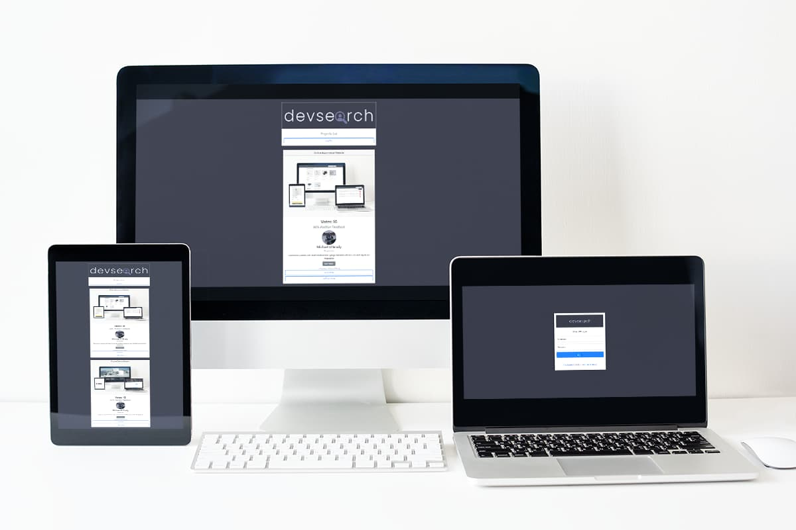
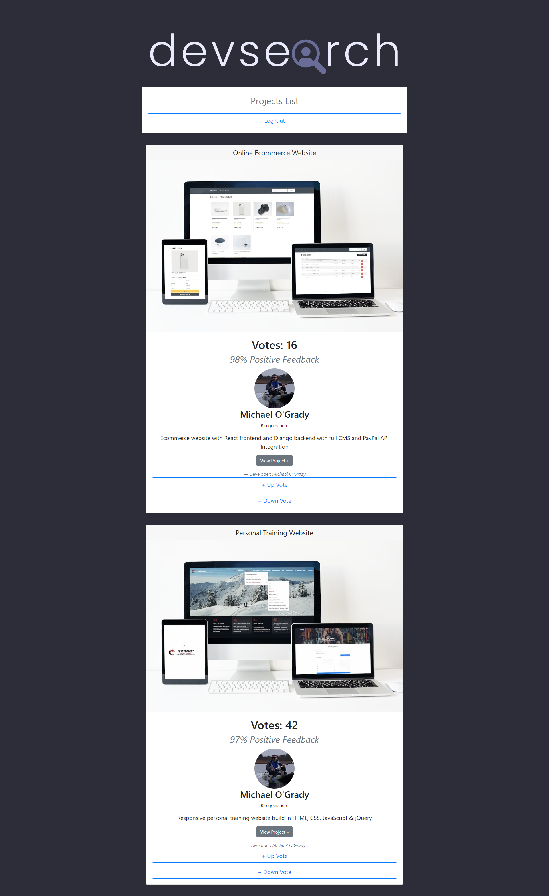
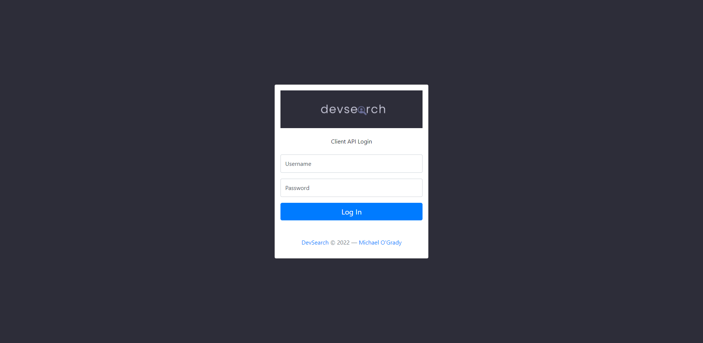
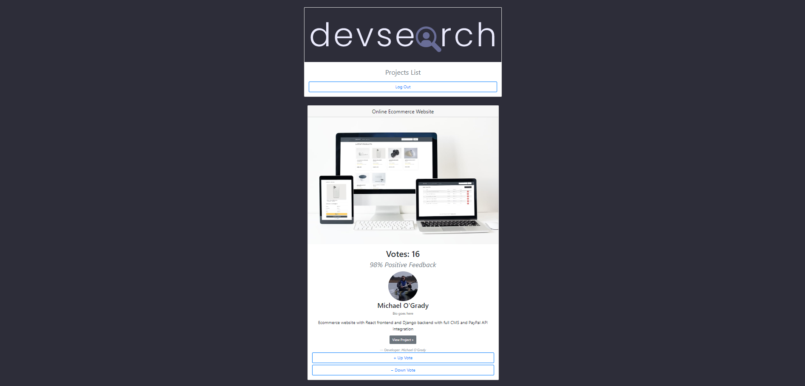

# devsearch-frontend

<h1 align="center">

</h1>

Basic frontend website to access the DevSearch API. Users registered with [DevSearch](https://devsearch-heroku.herokuapp.com/projects/) can login here to:

- View all Projects on DevSearch
- Rate project by:
  - Up Vote
  - Down Vote

> A project owner cannot vote on their own projects.

- Link to [frontend](http://www.api.devsearch.ie/)

## Project Details

- Frontend is hosted on Heroku
- The frontend reaches out to the backend API running on the Heroku server running on [https://devsearch-heroku.herokuapp.com](https://devsearch-heroku.herokuapp.com)
- To see the login (token) endpoint route in the browser running on the Django REST framework [click here](https://devsearch-heroku.herokuapp.com/api/users/token/). This is essentially the same as logging in via this frontend.
  - A successful login returns:
    - refresh token
    - access token
  - When using this frontend application, these are added to the browser storage allowing you to login to the application.

<h1 align="center">

</h1>
